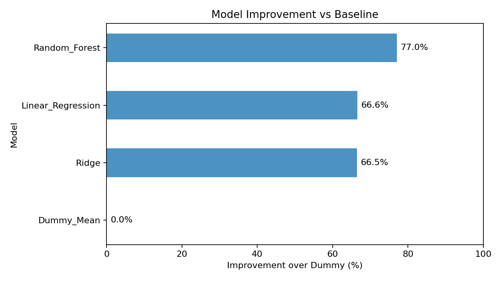
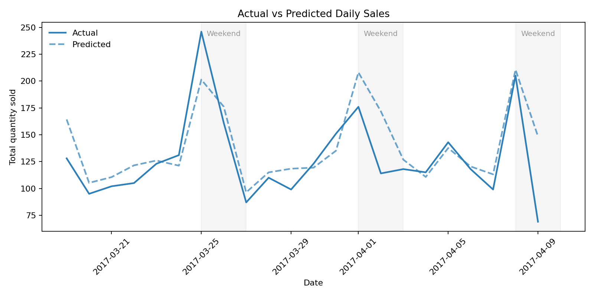
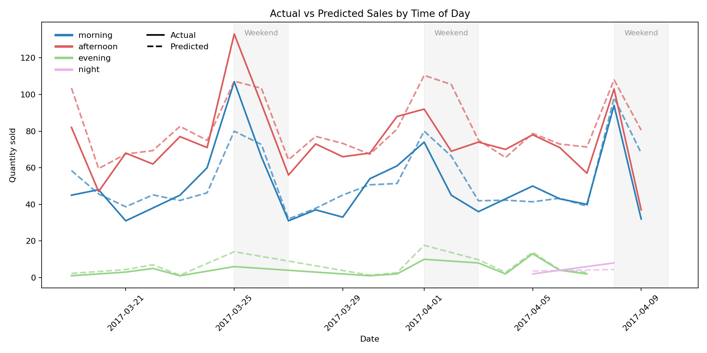
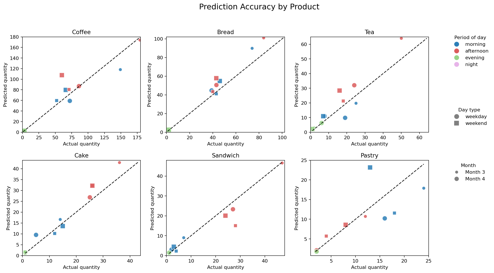

# Bakery Demand Demo

[]()
[]()
[]()

[]()
## Table of Contents
- [Overview](#overview)
- [Dataset](#dataset)
- [Models list](#models-list)
- [Dataset split](#dataset-split)
- [Model performance](#model-performance)
- [Example visualisations](#example-visualisations)
- [Why](#why)
- [Next](#next)

---

## Overview

- Predict bakery item demand  
- Compare multiple models  
- Select the best-performing model  
- Evaluate on unseen test data  
- Keep everything simple, explainable, and robust  

---

## Dataset

Sell example csv file from [Kaggle](https://www.kaggle.com/datasets/akashdeepkuila/bakery/data):

| Transaction | sell_item | date_time | period_day | weekday_weekend |
|--------|------------|------------|------------|------------|
|1	|Bread	|10/30/2016 9:58	|morning	|weekend|
|2	|Scandinavian	|10/30/2016 10:05	|morning	|weekend|
|2	|Scandinavian	|10/30/2016 10:05	|morning	|weekend|
|3	|Hot chocolate	|10/30/2016 10:07	|morning	|weekend|
|3	|Jam	|10/30/2016 10:07	|morning	|weekend|

Each row represents sales for an item in a specific context:

| Feature | Description |
|--------|------------|
| sell_item | Product type (bread, cake, etc.) |
| period_day | Morning or Afternoon |
| weekday_weekend | Weekday or weekend |
| month | Seasonality |
| sales | Target variable |

---

## Models list

A few basic machine learning models are used in the training sets.

- Dummy mean (baseline)  
- Linear Regression  
- Random Forest   

Each model is wrapped in a pipeline:

```python
Pipeline([
    ("preprocessor", preprocessor),
    ("model", model)
])
```

---

## Dataset split

We use a time-aware split by first 75%, 15% and 15%:

| Split | Purpose |
|------|--------|
| Train | Learn patterns |
| Validation | Model selection |
| Test | Final evaluation |

This avoids data leakage and reflects real-world forecasting.

---

## Model performance

| Model | Validation RMSE (Rooted Mean Sequare Error) |
|------|----------------|
| Dummy | High |
| Linear | Medium |
| Random Forest | Low |

The best model is selected based on validation score, the lower RMSE is, the better the model performs. 

---

## Example visualisations

The exported prediction files are used to create a small set of [business-friendly plots](https://github.com/sloxen/AutoPred/tree/main/demo/bakery_kaggle/plots).  


These visuals focus on three simple questions:

- Does the model follow the real sales pattern?
- Which model performs best against the baseline?
- Which products are predicted more accurately?

---

### Model improvement against baseline



This chart compares model performance against the dummy mean baseline.

The dummy mean model is set to zero percent because it simply predicts the average quantity from the training data.  
A higher percentage means the model explains more variation than the baseline.

Random Forest performs best in this demo.

---

### Actual vs predicted daily sales



This chart compares the total actual quantity sold with the total predicted quantity sold on the test set.

The solid line shows the real sales.  
The dashed line shows the model prediction.  
Grey bands highlight weekends, where bakery demand may behave differently.

---

### Actual vs predicted sales by time of day



This chart breaks the prediction down by time of day.

Colour shows the sales period:

- morning
- afternoon
- evening
- night

Line style shows the comparison:

- solid line = actual sales
- dashed line = predicted sales

This helps show whether the model captures different demand patterns across the day.

---

### Prediction accuracy by product



Each point compares actual quantity with predicted quantity for one product group.

The dashed diagonal line represents perfect prediction.  
Points closer to the line mean better prediction accuracy.

The plot also adds business context:

- colour shows time of day
- shape shows weekday or weekend
- point size shows month

This makes it easier to see where the model is reliable and where it may need more data or better features.

---

## Next 

- Add pricing features  
- Add promotions or events
- Deploy as API or dashboard  


